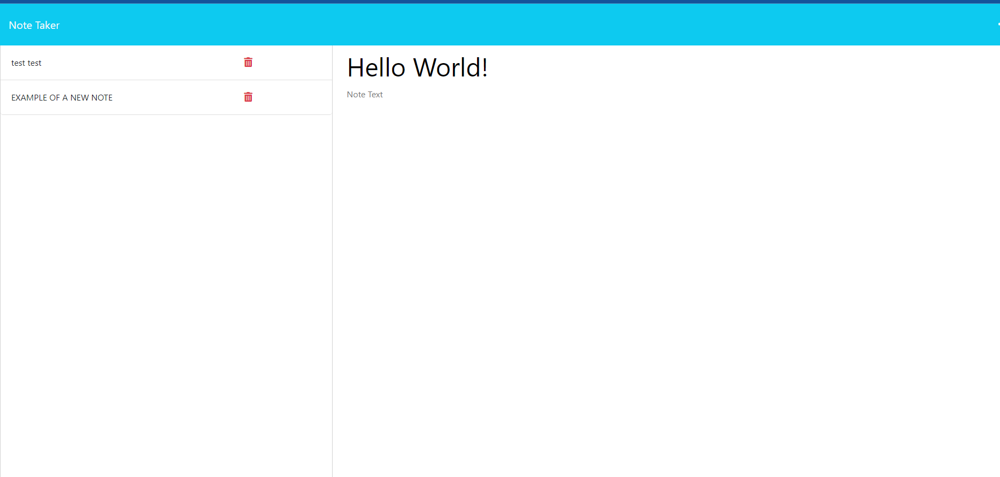

# Note Taker App

- Welcome to Note Taker! an intuitive app for users including front end and back end functionality being bridged using the express application server! 

- A simple visit the web page and there is a simple UI suggesting user clicks the '+' button in order to ADD a new note!

- Once a note is added, it is saved on the back end to be retrieved at a later date and viewed by the user.

- The user also has the ability to delete notes accordingly removing them from the front end and then seeing these changes on the back end as well. 


## User Story

```
AS A small business owner
I WANT to be able to write and save notes
SO THAT I can organize my thoughts and keep track of tasks I need to complete
```

## Acceptance Criteria

```
GIVEN a note-taking application:

- WHEN I open the Note Taker, THEN I am presented with a landing page with a link to a notes page.

- WHEN I click on the link to the notes page, THEN I am presented with a page with existing notes listed in the left-hand column, plus empty fields to enter a new note title and the note’s text in the right-hand column.

- WHEN I enter a new note title and the note’s text, THEN a Save icon appears in the navigation at the top of the page.

- WHEN I click on the Save icon, THEN the new note I have entered is saved and appears in the left-hand column with the other existing notes.

- WHEN I click on an existing note in the list in the left-hand column, THEN that note appears in the right-hand column.

- WHEN I click on the Write icon in the navigation at the top of the page, THEN I am presented with empty fields to enter a new note title and the note’s text in the right-hand column. 

```

## Screenshot: 

